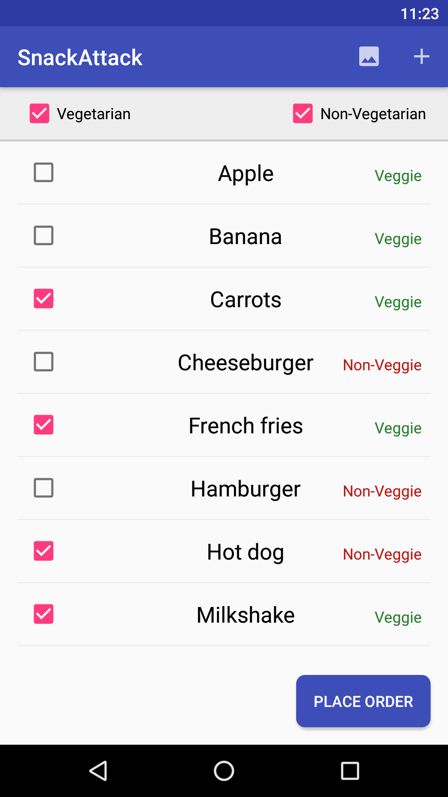

# SnackAttack

A Mini Snack Ordering Challenge Project.

## Task

Create an Android app which shows a list of snacks to choose from for a quick mid-day snack. The snacks [listitems]
can be veggies [text in green color] or non-veggies [text in red color] with a checkbox:

    French-fries [  ]
    Milk-shake [  ]
    Chicken-burger [  ]
    Veggie-burger [  ]

## First Use Case

The user should be able to select snacks from the list:

1. There will be 2 checkboxes, i.e. Veggies & Non-veggies, with both initially checked at the top.
2. The user can select 1 or both. The list items will be updated with the option chosen from.
3. If both are selected, show all the snacks. If none are selected, show none.
4. Submit button at the bottom will finish the order and show the summary (a list of selected snacks) in
a dialog.
5. All selections will be returned to default once the dialog is dismissed.

## Second Use Case

The user should be able to add more snacks to the list:

1. There must be an “add” action in the action bar at the top of the app
2. When a user selects the “add” action, a dialog is displayed.
3. The dialog should have a toggle for veggie/non-veggie, and a text field to enter the new snack name
4. The dialog should have “Save” and “Cancel” buttons.
5. When the user hits “Save”, the dialog is dismissed, and the user’s new snack is added to the list.
6. When the user hits “Cancel”, the dialog is dismissed.

## Full list of starting snacks:

### Veggie:

 - French fries
 -  Veggieburger
 -  Carrots
 -  Apple
 -  Banana
 -  Milkshake

### Non-veggie:

 - Cheeseburger
 - Hamburger
 - Hot dog
